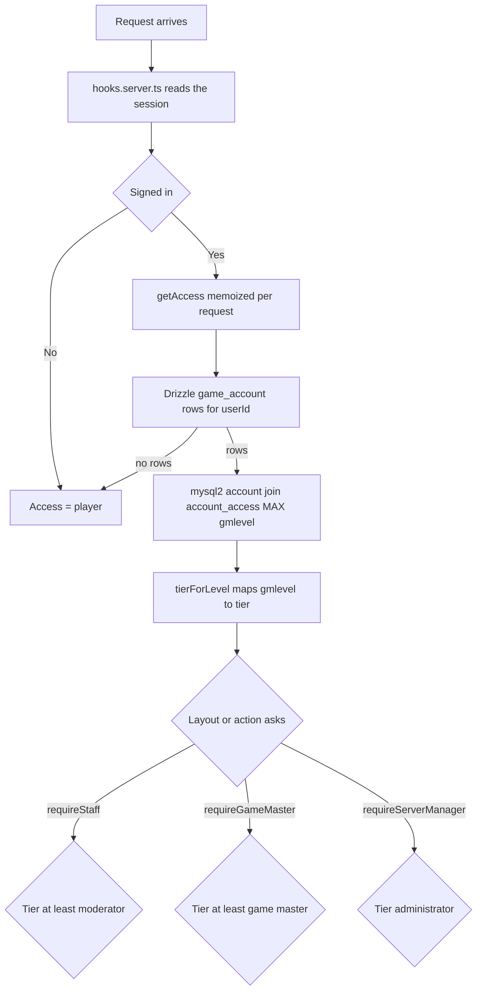

# Design — AzerothCore GM-level permissions and tiered gating

**Status:** proposed, awaiting review
**Roadmap item:** 3 — "Close the authorization gate" ([`AGENTS.md`](../AGENTS.md))
**Supersedes:** the placeholder rule in [`src/lib/server/authz.ts`](../src/lib/server/authz.ts)

---

## 1. Goal

Replace the placeholder [`isServerManager()`](../src/lib/server/authz.ts:31) — which currently admits
**every** signed-in user — with the real rule: the GM level on the AzerothCore game account linked to
the signed-in profile, read from `acore_auth`, mapped onto a tier ladder that gates routes, navigation
and form actions.

Scope of this change: the **permission model, its enforcement, and one demonstrable unlock per tier**.
It deliberately does not add new management features (characters, bans, a command box) — those are
roadmap item 4 and slot into the tiers this establishes.

## 2. What is true today (verified in source)

| Fact                                                                                       | Where                                                                                       |
| ------------------------------------------------------------------------------------------ | ------------------------------------------------------------------------------------------- |
| `isServerManager(user)` returns `user !== null` — a signed-in user of any kind passes      | [`authz.ts`](../src/lib/server/authz.ts:31)                                                 |
| The intended query is already documented, including `aa.RealmID = -1`                      | [`authz.ts`](../src/lib/server/authz.ts:18)                                                 |
| `/admin` runs `requireUser` then `requireServerManager` on the group layout                | [`(admin)/+layout.server.ts`](<../src/routes/(admin)/+layout.server.ts:14>)                 |
| `showAdminNav` is computed in a server load because components cannot import `$lib/server` | [`(authenticated)/+layout.server.ts`](<../src/routes/(authenticated)/+layout.server.ts:19>) |
| The `/admin` **action** `check` has no authorization check at all                          | [`(admin)/admin/+page.server.ts`](<../src/routes/(admin)/admin/+page.server.ts:27>)         |
| `game_account` **is** migrated — `AGENTS.md` says otherwise and is stale                   | [`0001_awesome_tombstone.sql`](../drizzle/0001_awesome_tombstone.sql:1)                     |

### 2.1 The hole this change has to close

SvelteKit runs **actions before loads**, and re-runs loads afterwards — _"After an action runs, the
page will be re-rendered … This means that your page's `load` functions will run after the action
completes."_ ([`llms/sveltekit/llms-full.txt`](../llms/sveltekit/llms-full.txt:19356))

Consequence: **a route-group layout does not guard a form action.** Today, any POST to the `check`
action on `/admin` executes a SOAP console command with the site's administrator credential, and only
_then_ does the layout 403 the response. The gate as currently written is therefore decorative for
actions, and this is the first thing the new model must fix.

The project rule _"layouts call `require*`; pages do not re-check"_ stays correct for **loads**, and
gains one explicit exception: **every action re-checks for itself.**

## 3. Decisions

Taken by the user, with the one conflict resolved as noted:

1. **Full tier model** — four tiers, thresholds ≥1 / ≥2 / ≥3.
2. **Lookup is live, per request, with no caching.** _Resolved conflict:_ the request asked for both
   "no caching" and "a short cache". **No cache is implemented.** What is allowed, and all that is
   meant by "short cache", is **memoisation inside a single request** (§6) so one request never issues
   the same query twice. Nothing survives the request, so a GM-level change takes effect on the next
   request and there is no stale state to reason about.
3. **Any realm row counts.** `account_access` has a `RealmID` column where `-1` means "all realms".
   This site has no realm model, so **any** row for a linked account grants the level — a
   realm-scoped GM gets site-wide staff access. Documented as a known widening, tightenable later by
   adding a configured realm id and filtering on it.
4. **`account_access` is read, never written.** It is AzerothCore's table.
5. **One staff namespace, tier floors in the folder names.** Everything staff-facing lives under
   `/staff`, and each tier-named folder declares its own floor on its own layout (§7.1).

## 4. The model

| AzerothCore constant | `gmlevel` | Tier            | Unlocks in this change                                             |
| -------------------- | --------- | --------------- | ------------------------------------------------------------------ |
| `SEC_PLAYER`         | 0         | `player`        | nothing staff-facing                                               |
| `SEC_MODERATOR`      | 1         | `moderator`     | `/staff` and `/staff/moderator` — the read-only staff area         |
| `SEC_GAMEMASTER`     | 2         | `game-master`   | `/staff/gm` — read-only console diagnostics                        |
| `SEC_ADMINISTRATOR`  | 3         | `administrator` | `/staff/admin` — dangerous tooling, the Administration nav section |
| `SEC_CONSOLE`        | 4         | `administrator` | clamped to `administrator`                                         |

- The **effective level** is the **maximum** `gmlevel` across all of a profile's linked game accounts.
- Levels above 4 clamp to `administrator`; a level below 1 is `player`.
- `SEC_ADMINISTRATOR` is the level the worldserver's own SOAP console demands
  ([`authz.ts`](../src/lib/server/authz.ts:23)), which is why the tier that unlocks anything the site
  can _do_ on the server is set there.



## 5. Module layout

No schema change, therefore **no migration**. The Drizzle schema in
[`schema.ts`](../src/lib/server/db/schema.ts) is untouched.

| File                                       | Role                                                                                                                                                                                    |
| ------------------------------------------ | --------------------------------------------------------------------------------------------------------------------------------------------------------------------------------------- |
| `src/lib/access.ts` **(new)**              | Client-safe vocabulary: `AccessTier`, `SEC_*` level constants, `tierForLevel`, `tierAtLeast`, `TIER_LABELS`, `Access`. Pure, no imports from `$lib/server`.                             |
| `src/lib/server/acore/access.ts` **(new)** | Integration layer: `readAccountLevels(usernames)` — one parameterised query against `getAcoreAuthDb()`.                                                                                 |
| `src/lib/server/authz.ts` **(rewritten)**  | The only policy home: `resolveAccess`, `getAccess`, `isServerManager`, `requireUser` / `requireStaff` / `requireGameMaster` / `requireServerManager`, `safeRedirectTarget` (unchanged). |
| `src/lib/navigation.ts`                    | `NavItem` gains `minTier?: AccessTier`; add `staffNav`; add `visibleNav(items, tier)`.                                                                                                  |
| `src/app.d.ts`                             | **Unchanged** — see §6.                                                                                                                                                                 |

### 5.1 The query

```sql
SELECT a.username AS username, MAX(aa.gmlevel) AS gmlevel
FROM account a
LEFT JOIN account_access aa ON aa.id = a.id
WHERE a.username IN (?, ?)
GROUP BY a.username
```

- `LEFT JOIN` so a linked account with **no** `account_access` row still comes back, as level 0 —
  missing means "ordinary player", never "unknown".
- No `RealmID` filter, per decision 3.
- `MAX` collapses the one-row-per-realm shape of `account_access` into one level per account.
- Called only when the profile actually has linked rows, and called with an `IN` list bounded by a
  profile's account count — the placeholder style already used by
  [`listPlayerAccounts()`](../src/lib/server/accounts/service.ts:175).
- Indexed access: `game_account.user_id` has an index; the join to `account_access` is on the primary
  key. This is the cheap direction, unlike the `account.email` table scan in `listPlayerAccounts`.

## 6. Access resolution and the "no cache" rule

```ts
const accessByLocals = new WeakMap<App.Locals, Promise<Access>>();

export function getAccess(locals: App.Locals): Promise<Access> {
	/* resolve once per request */
}
```

- The memo key is the **request's `locals` object**, which SvelteKit creates per request. Because the
  key dies with the request, so does the value: **this is not a cache.** No TTL, no module-level map,
  no session field, no column on `game_account`.
- A request never queries twice even though a layout load, a page load and an action may each ask.
- `handle` runs before an action and does not re-run for the following loads
  ([`llms/sveltekit/llms-full.txt`](../llms/sveltekit/llms-full.txt:19358)), so both paths see the
  same request-scoped value.
- `src/app.d.ts` needs no change, and nothing access-related is ever placed on `locals` where a
  component could read it.

### 6.1 Failure behaviour — fail closed

If `ACORE_DATABASE_URL` is unset, the MySQL server is down, or the query fails, `resolveAccess`
**resolves to `player`** rather than throwing: a broken link to AzerothCore must never 500 every page
in the app. The trade-off is explicit and accepted — an AzerothCore outage removes staff access rather
than granting it, and the failure is logged. **Failing open is rejected.**

## 7. Enforcement points

### 7.1 Loads — one staff namespace with tier floors in the folder names

| Route                                          | Guard                                                | Floor                          |
| ---------------------------------------------- | ---------------------------------------------------- | ------------------------------ |
| `(authenticated)` at `/dashboard`, `/accounts` | `requireUser` — unchanged                            | any session                    |
| `(staff)` group layout, root `/staff`          | `requireUser` then `requireStaff`                    | ≥1                             |
| `/staff/moderator`                             | its own `+layout.server.ts`                          | ≥1 — the moderation-tools home |
| `/staff/gm`                                    | its own `+layout.server.ts` → `requireGameMaster`    | ≥2                             |
| `/staff/admin`                                 | its own `+layout.server.ts` → `requireServerManager` | ≥3                             |

Everything staff-facing lives under one namespace, `/staff`, and each tier-named folder declares its own
floor on its own layout — so a page's guard is one line in one file, and the project rule _the layout
enforces, pages do not re-check_ still holds.

This shape is deliberately **non-inverted**: the group layout carries the _weakest_ rule and every
sibling beneath it is stricter or equal, so a parent never refuses a page a child would have allowed.
The inverse — lower tiers hung beneath a stricter root — is not expressible in SvelteKit at all, because
a parent layout's `error(403)` fires before the child is ever reached.

**The folder name is a floor, and it is part of the contract.** A tool lives in the folder matching its
_softest_ audience, and a leaf may be **stricter** than its folder but **never laxer**: a dangerous
action inside `/staff/gm` that declares `requireServerManager` is correct, while a GM-tier page sitting
under `/staff/moderator` is not. The folder name is also what tells a reader the threshold without
opening the layout — the property prefix-per-tier had, and the one an `/admin/**` tree would lose.

The `(admin)` group and its `/admin` URL are **retired**: the read-only diagnostics page moves to
`/staff/gm`, and `/staff/admin` becomes the home of roadmap item 4.

### 7.1.1 Guardrail — a tripwire spec for the floors

Because the group layout is the weakest rule, a folder added under `/staff` with no layout of its own
would sit quietly at ≥1. A spec walks the real route tree and, for every folder under
`(staff)/staff/**` other than the root that contains a `+page.svelte`, requires a `+layout.server.ts`
declaring exactly one `require*` helper, maps that helper to a tier, and asserts it is **not below** the
floor in the folder name. It is a text-level tripwire rather than a semantic proof — honest about what it
can check — and it turns forgetting a folder into a failing test instead of a silent widening of access.

### 7.2 Actions (the exception)

Each action re-resolves access for itself:

- [`(admin)/admin/+page.server.ts`](<../src/routes/(admin)/admin/+page.server.ts:27>) `check` — the page
  moves to `/staff/gm` and the action gains `requireGameMaster`. **This is the security fix**, not a
  formality: it closes a live hole.
- The future command box on `/staff/admin` → `requireServerManager`, declared on the action itself and
  never inferred from the folder it lives in.
- [`(authenticated)/accounts/+page.server.ts`](<../src/routes/(authenticated)/accounts/+page.server.ts:39>)
  `create` / `link` / `unlink` → `requireUser` only, and **documented as such**: each operates strictly
  on the caller's own `user.id`, so no elevation is involved. The reasoning is written down so a future
  reader does not mistake the asymmetry for an oversight.

Checks throw `error(403, …)`, consistent with the layouts. A forged POST therefore gets a 403 error
page; the UI never offers an action the caller cannot perform, so form-level `fail()` handling is not
needed.

Enforcement in `hooks.server.ts` for all POSTs is considered and **rejected**: it cannot distinguish a
player action from a staff action, so it would either block legitimate player actions or be a no-op.

### 7.3 UI

- `NavItem.minTier` plus `visibleNav(items, tier)` make nav visibility data, matching the
  "navigation is data" convention in [`navigation.ts`](../src/lib/navigation.ts:7).
- [`AppShell.svelte`](../src/lib/components/site/AppShell.svelte:14) and
  [`SiteNav.svelte`](../src/lib/components/site/SiteNav.svelte:6) gain one optional `staff?: NavItem[]`
  prop and one extra section label, so the sections read **Player / Staff** — a single staff section
  whose items are filtered by `minTier`, rather than one section per tier.
- `(authenticated)`'s `showAdminNav` goes away: the layouts pass the **tier**, and the shell filters the
  static nav arrays with `visibleNav`. Returning a filtered `NavItem[]` instead is not just unnecessary,
  it is impossible — an item carries an icon component, and load data is serialized as JSON, which fails
  loudly on a function. Found the hard way: `/dashboard` answered 500 with "Cannot stringify a function
  (data.staffNav[0].icon)".
- Only a derived, client-safe `Access` (`{ tier, level }`) crosses to the browser — never usernames,
  never account rows. `level` is the visitor's own GM level.

## 8. Resulting routes

```
/staff             >= 1   staff dashboard; content adapts to the visitor's tier
/staff/moderator   >= 1   the moderation-tools home
/staff/gm          >= 2   read-only console diagnostics — the .server info check, moved off /admin
/staff/admin       >= 3   the dangerous-tooling home; the command box lands here next (roadmap item 4)
```

`/staff/gm` hosts the existing SOAP check that
[`(admin)/admin/+page.server.ts`](<../src/routes/(admin)/admin/+page.server.ts:22>) performs today. It is
read-only, but it does spend the site's administrator SOAP credential and reveal server internals, which
is a game-master concern rather than a moderator one.

Alternatives considered and rejected:

- **Everything under `/admin`**, with `/admin/server` and `/admin/console` beneath it. Equivalent in
  substance, but the root then reads as administrator-only while being reachable at ≥1, and `/admin` at
  ≥3 with weaker tiers underneath is not expressible without a second folder named `admin`. `/staff`
  names the area truthfully, since moderator-level staff use it.
- **Prefix per tier** (`/staff`, `/staff/server`, `/admin`) — the first draft. Truthful URLs and
  fail-safe defaults, but it splits one area across two arbitrary top-level prefixes and multiplies
  namespaces as roadmap item 4 adds tools.
- Leaving the diagnostics page at ≥3 and shipping tier 2 as helpers with no route. Rejected because it
  leaves tier 2 unexercised and untestable.

## 9. Edge cases

| Case                                           | Result                                                  |
| ---------------------------------------------- | ------------------------------------------------------- |
| Linked account has no `account_access` row     | level 0 → `player`                                      |
| Linked account deleted from `acore_auth`       | level 0                                                 |
| Several linked accounts                        | highest level wins                                      |
| Row scoped to one realm (`RealmID != -1`)      | counts, per decision 3                                  |
| `gmlevel` 4 or higher                          | clamped to `administrator`                              |
| Staff member has not linked a game account     | level 0 → no staff access; the accounts page is the fix |
| `ACORE_DATABASE_URL` missing or DB unreachable | `player`, logged, no 500 (§6.1)                         |
| Level changed in the database mid-session      | applies on the next request (§6)                        |

## 10. Rollout

**This is a real behaviour change.** Today every signed-in user reaches `/admin`; after this change the
staff area at `/staff` opens only to a profile whose linked game account carries an
`account_access.gmlevel` of at least 1, and `/staff/admin` needs at least 3. Before deploying, confirm
the intended staff have both a `game_account` link and an `account_access` row — otherwise the site locks
its own owner out of the staff area entirely, and the accounts page is the only way back in.

AzerothCore's worldserver caches account access in memory; the site reads the table directly, so a
level change is live on the site immediately while game-side access may lag until the server reloads.
Worth a line in the docs so the difference is not reported as a bug.

## 11. Verification

- New specs (both run in the `server` Vitest project — the `client` project only matches
  `*.svelte.spec.ts`, per [`vite.config.ts`](../vite.config.ts:42)):
  - `src/lib/access.spec.ts` — `tierForLevel` across 0–4 and out-of-range; `tierAtLeast` ordering.
  - `src/lib/server/authz.spec.ts` — `isServerManager` admits `administrator` only; each `require*`
    throws 403 for a lower tier and passes at or above its threshold; `visibleNav` filtering.
  - a route-tree tripwire for §7.1.1 — every folder under `/staff` below the root declares a `require*`
    helper, and never one below its folder's floor.
  - Note `expect.requireAssertions` is on ([`vite.config.ts`](../vite.config.ts:34)), so every test
    needs at least one assertion.
- Then the standard gate, once, at the end: `npm run check`, `npm run lint`,
  `npm run test:unit -- --run`, `npm run build`.
- `npm run test:e2e` needs a live database and downloaded browsers — not part of routine verification
  (documented in [`AGENTS.md`](../AGENTS.md)).
- Manual walk of the gate: `/staff` as a level-0 account (expect 403); a level-1 account (expect
  `/staff` and `/staff/moderator`, 403 on `/staff/gm` and `/staff/admin`); a level-2 account (expect
  `/staff/gm`); a level-3 account (expect everything) — plus a POST to the `check` action from a level-1
  session (expect 403 **and no SOAP call**).

## 12. Documentation to update

- **[`AGENTS.md`](../AGENTS.md):** the route-group table (`(staff)`, and what each layout enforces); the
  "Authorization is a placeholder" wording; a new _Permissions & access model_ section (tiers, the
  query, live per-request lookup, fail-closed); the load-vs-action rule with its new exception; the
  "Known issues" entries that this closes; Roadmap item 3 → done.
- **Stale claims this work exposes and should fix in passing:**
  `game_account` _does_ have a migration ([`0001_awesome_tombstone.sql`](../drizzle/0001_awesome_tombstone.sql:1)),
  and `src/lib/vitest-examples/**` is _not_ the only spec in the repo
  ([`rules.spec.ts`](../src/lib/server/accounts/rules.spec.ts), [`srp6.spec.ts`](../src/lib/server/accounts/srp6.spec.ts),
  [`soap-protocol.spec.ts`](../src/lib/server/acore/soap-protocol.spec.ts) all exist). Because real
  specs exist, the scaffold placeholder can now be deleted — which the `new-feature` skill rule prefers.
- **Skills that describe authorization as a placeholder** must be brought in line, starting with
  [`repo-context/SKILL.md`](.roo/skills/repo-context/SKILL.md) and checking
  [`auth-setup/SKILL.md`](.roo/skills/auth-setup/SKILL.md).
- `.env.example` needs **no** change; no new variable is introduced.

## 13. Explicitly out of scope

- A realm model, per-realm staff scoping.
- Per-command permissions inside the console; any command _execution_ UI.
- Caching GM levels across requests, in the session, or in `game_account`.
- Roles in Better Auth (`user.role`) — AzerothCore owns the level; duplicating it here would create two
  sources of truth.
- Reading staff levels for _other_ players, or any staff-facing account administration.

## 14. Open question

1. **Polish:** show the signed-in staff member's tier as a badge in
   [`UserMenu.svelte`](../src/lib/components/site/UserMenu.svelte:71), or leave the filtered Staff nav
   section as the only visible signal?
